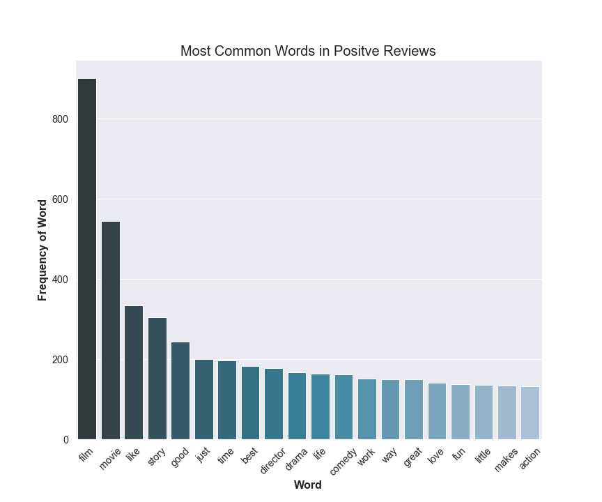
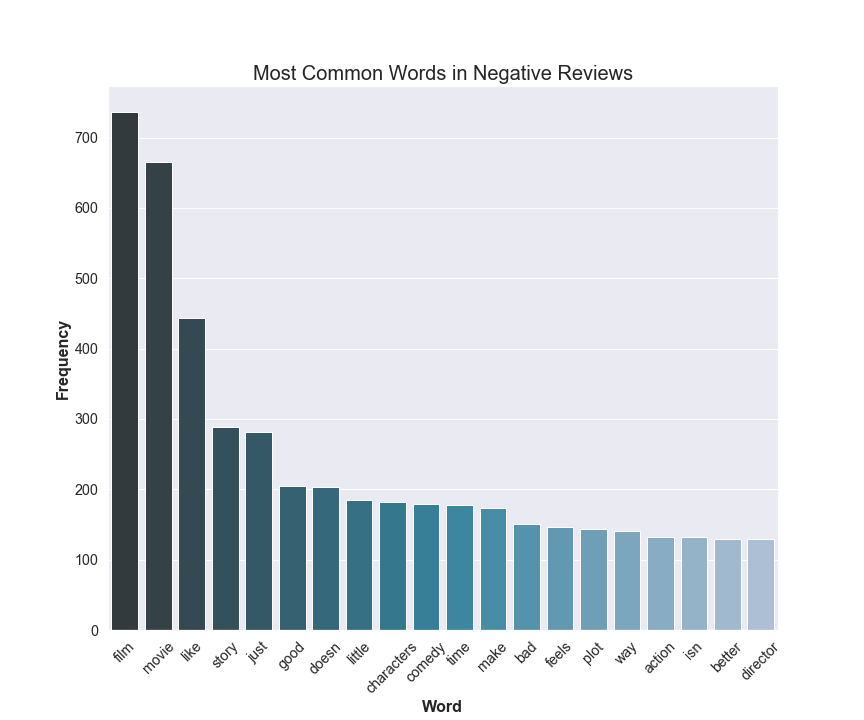
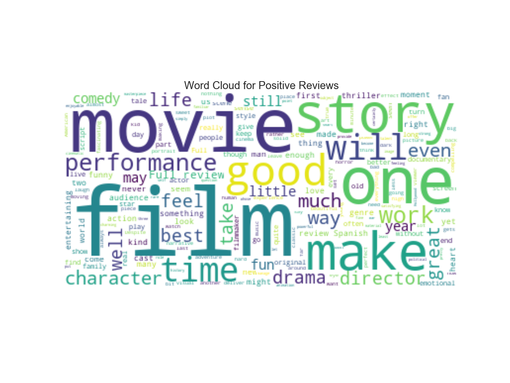

# Sentiment Prediction of a Rotten Tomatoes Critic's Review Dataset using NLP

### by: Joe Tustin

"The scope of this project included EDA, Feature Analysis, Principal Component Analysis, and a Naive Bayes predictive model."

## Table of Contents
1. [Description of Dataset](#DescriptionofDataset)
2. [Exploratory Data Analysis](#eda)
    1. [Dataset](#dataset)
    2. [Data Cleaning](#cleaning)
    3. [Sentiment Analysis](#sentimentanalysis)
3. [Modelling](#model)
    1. [Naive Bayes](#naivebayes)
4. [Conclusions](#conclusions)

## Description of Dataset 

WHAT IS THE TOMATOMETER®?
The Tomatometer score – based on the opinions of hundreds of film and television critics – is a trusted measurement of critical recommendation for millions of fans.
Back in the days of the open theaters, when a play was particularly atrocious, the audience expressed their dissatisfaction by not only booing and hissing at the stage, but also throwing whatever was at hand – vegetables and fruits included.
The Tomatometer score represents the percentage of professional critic reviews that are positive for a given film or television show. A Tomatometer score is calculated for a movie or TV show after it receives at least five reviews.
When at least 60% of reviews for a movie or TV show are positive, a red tomato is displayed to indicate its Fresh status.
When less than 60% of reviews for a movie or TV show are positive, a green splat is displayed to indicate its Rotten status.

## Exploratory Data Analysis 

### Dataset 

The initial dataset consisted of 420,000 reviews.  The dataset was evenly balanced with an equal number of positive and negative reviews.  With random guessing, we would have a baseline predictive ability of 50%.  Let's see if we can do better!

**Table 1**: Initial dataset

|    |   Freshness |   Review |
|---:|-----------:|:-----------------------|
|  0 |       1   | Manakamana doesn't answer any questions, yet makes its point: Nepal, like the rest of our planet, is a picturesque but far from peaceable kingdom.   |   
|  1 |       1   | Wilfully offensive and powered by a chest-thumping machismo, but it's good clean fun.   |
|  2 |       0   | It would be difficult to imagine material more wrong for Spade than Lost & Found.  |
|  3 |       0   | Despite the gusto its star brings to the role, it's hard to ride shotgun on Hector's voyage of discovery.   |

***CATEGORICAL Data: Target***
- The target was categorical in nature.  A review is either good or bad and is represented as a one or zero.

***NUMERICAL Data: Features (after vectorization)***
- The string was broken down into a list of strings or tokens.  These words were then counted into numerical data using CountVectorizer.  The feature size of this new representation of the data varied from 10,000 to 110,000 features depending on the use of single words to bigrams.  For modeling purposes, I stayed with used 10,000 rows for training purposes and 2,500 rows for test purposes.

### Data Cleaning 

CountVectorizer was my workhorse function.  In using this function, I was able to lowercase my data, filter out accents and stop words, set max_features(ie-10,000), and set min_df(ie-2)

***CountVectorizer  (lowercase=True, tokenizer=None, ngram_range=(1,2),strip_accents= "ascii", stop_words='english',
                             analyzer='word', max_df=1.0, min_df=2,
                             max_features=10,000)***

The output of the CountVectorizer was a sparse array which was converted to numpy arrays using  the .toarray() method.  This step was needed to get my X_train, X_test, y_train, y_test arrays used for the sklearn models.

To explore the data, I made a corpus  and word dictionary followed by a bag of words array (document) for each review.  A graphical representation of the most common words for both positive and negative reviews are shown below:

### Sentiment Analysis 
The DataFrame simply consists of two columns(the target and the string document for the reviews):

In a world where we generate 2.5 quintillion (10^18) bytes of data every day, sentiment analysis has become a key tool for making sense of that data. This has allowed companies to get key insights and automate all kinds of processes. In many of the articles referring to sentiment analysis, a plot of the distribution of review lengths for both positive and negative reviews was recommended as a good first step.  My plot for positive and negative reviews is shown below, but unfortunately, no new useful information was found.

## Modeling 
To model this dataset, several models were considered.  Naive Bayes, Neural Networks(RNN), and Logistic Regression models were all good candidates for Natural Language Processing.  Ultimately, I chose a multinomial Naive Bayes model based on its ease of use and success as seen in previous work.  The Laplacian smoothing coefficient (alpha) was kept at a value of one.  The best predictive result for the model (accuracy) was 74%.  The result was found using a tf-idf matrix converted from the original count vectorization matrix using TfidfTransformer. In this best case model, the max number of features was 50,000, the min_df was 2, and bigrams were used as well as single word features.  The model results improved when switching from count vectorized data to tf-idf data.  The results also improved when switching form single word features to a combination with bigrams.  In both cases, the results improved by about 1.5%.  

It’s estimated that different people only agree around 60-65% of the time when judging the sentiment for a particular piece of text.  So... in theory, it is interesting that the result of the model is on this same order.

### Something a little fun! "Thanks for the suggestion Kayla"

## Conclusions 

1. Natural Language Processing is hard!  There is an excessive number of features leading to model complexing.  Using models that reduce or simplify this complexity is key as well as data cleaning measures which simplify the tf-idf matrix as well as the corpus dictionary of words.

2.  I need to re-address my principal component analysis.  I had extremely bad results which do not match my predictive success rate.  I will have to redo this part.  I would expect to have more of the variance accounted for in the first two principal components.  

3. Feature engineering is key.  I would like to build a dictionary of the fifty most predictive features for both positive and negative results using both single words and bigrams, and then, weight these features more highly than my other features.  And....try, try again.

2. As a side note, check out "Return of the Killer Tomatoes" starring a very young George Clooney.  It received a Rotten Tomatoes score of: "Rotten".  It would be an interesting late night, B-movie to watch.  Would you agree with its rating?  As with all nlp, it is subjective which makes it hard to predict!!!
