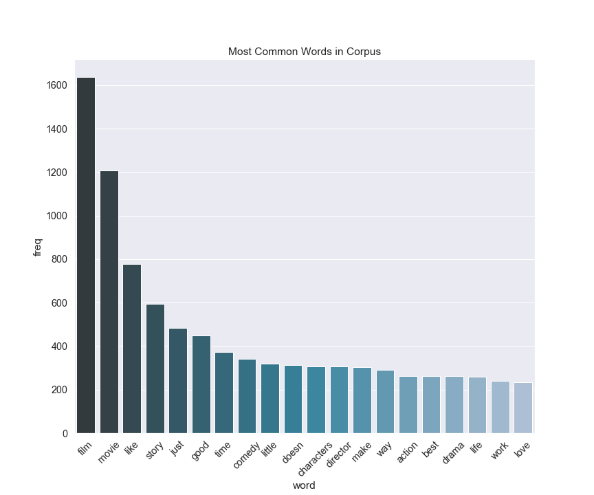
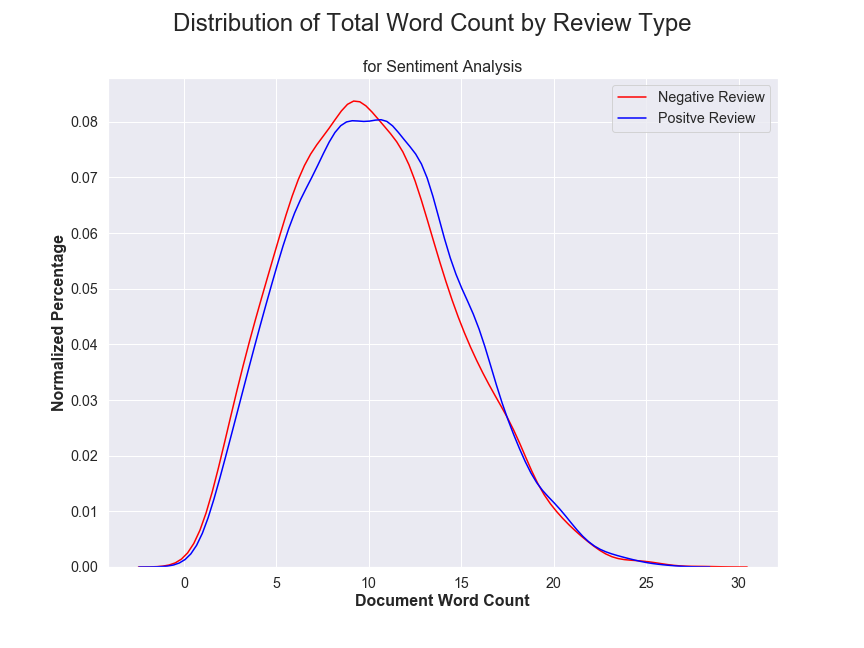

# Sentiment Prediction of a Rotten Tomatoes Critic's Review Dataset using NLP

### by: Joe Tustin

"The scope of this project included EDA, Feature Analysis, Principal Component Analysis, and a Naive Bayes predictive model."

## Table of Contents
1. [Description of Dataset](#DescriptionofDataset)
2. [Exploratory Data Analysis](#eda)
    1. [Dataset](#dataset)
    2. [Data Cleaning](#cleaning)
    3. [Methods Used](#methodsused)
3. [Modelling](#model)
    1. [Naive Bayes](#naivebayes)
    2. [Neural Network](#concurrentneuralnetwork)
4. [Conclusions](#conclusions)

## Description of Dataset 

WHAT IS THE TOMATOMETER®?
The Tomatometer score – based on the opinions of hundreds of film and television critics – is a trusted measurement of critical recommendation for millions of fans.
Back in the days of the open theaters, when a play was particularly atrocious, the audience expressed their dissatisfaction by not only booing and hissing at the stage, but also throwing whatever was at hand – vegetables and fruits included.
The Tomatometer score represents the percentage of professional critic reviews that are positive for a given film or television show. A Tomatometer score is calculated for a movie or TV show after it receives at least five reviews.
When at least 60% of reviews for a movie or TV show are positive, a red tomato is displayed to indicate its Fresh status.
When less than 60% of reviews for a movie or TV show are positive, a green splat is displayed to indicate its Rotten status.

## Exploratory Data Analysis 

### Dataset 

The initial dataset consisted of 420,000 reviews.  The dataset was evenly balanced with an equal number of positive and negative reviews.  With random guessing, we would have a baseline predictive ability of 50%.  Let's see if we can do better!

**Table 1**: Initial dataset

|    |   Freshness |   Review |
|---:|-----------:|:-----------------------|
|  0 |       1   | Manakamana doesn't answer any questions, yet makes its point: Nepal, like the rest of our planet, is a picturesque but far from peaceable kingdom.   |   
|  1 |       1   | Wilfully offensive and powered by a chest-thumping machismo, but it's good clean fun.   |
|  2 |       0   | It would be difficult to imagine material more wrong for Spade than Lost & Found.  |
|  3 |       0   | Despite the gusto its star brings to the role, it's hard to ride shotgun on Hector's voyage of discovery.   |

***CATEGORICAL Data: Target***
- The target was categorical in nature.  A review is either good or bad and is represented as a one or zero.

***NUMERICAL Data: Features (after vectorization)***
- The string was broken down into a list of strings or tokens.  These words were then counted into numerical data using CountVectorizer.  The feature size of this new representation of the data varied from 10,000 to 110,000 features depending on the use of single words to bigrams.  For modeling purposes, I stayed with used 10,000 rows for training purposes and 2,500 rows for test purposes.

### Data Cleaning 

CountVectorizer was my workhorse function.  In using this function, I was able to lowercase my data, filter out accents and stop words, set max_features(ie-10,000), and set min_df(ie-2)

***CountVectorizer  (lowercase=True, tokenizer=None, ngram_range=(1,2),strip_accents= "ascii", stop_words='english',
                             analyzer='word', max_df=1.0, min_df=2,
                             max_features=10,000)***

The output of the CountVectorizer was a sparse array which was converted to numpy arrays using  the .toarray() method.  This step was needed to get my X_train, X_test, y_train, y_test arrays used for the sklearn models.

To explore the data, I made a corpus  and word dictionary followed by a bag of words array (document) for each review.  A graphical representation of the most common words is shown below:

### Methods Used 
The DataFrame simply consists of two columns(the target and the string document for the reviews):

In a world where we generate 2.5 quintillion (10^18) bytes of data every day, sentiment analysis has become a key tool for making sense of that data. This has allowed companies to get key insights and automate all kinds of processes. In many of the articles referring to sentiment analysis, a plot of the ditribution of review lengths for both postitive and negative reviews was recommended as a good first step.  My plot for positive and negative reviews is shown below, but unfortunately, no new useful information was found.

### Data Cleaning 

**Figure 1**: Correlation matrix for the features in the dataset

The only features that seem strongly correlated are `surge_pct` and `avg_surge`, therefore no features needed to be dropped.

**Table 3**: Cleaned data type and null value descriptions

 |   column name |   information |
 |---:|-----------:|
|avg_dist                |  50000 non-null float64|
|avg_rating_by_driver    |  50000 non-null float64|
|avg_rating_of_driver     | 50000 non-null float64|
|avg_surge                 |50000 non-null float64|
|last_trip_date      |      50000 non-null datetime64[ns]|
|signup_date          |     50000 non-null datetime64[ns]|
|surge_pct             |    50000 non-null float64|
|trips_in_first_30_days |   50000 non-null int64|
|luxury_car_user    |       50000 non-null bool|
|weekday_pct         |      50000 non-null float64|
|city_King's Landing  |     50000 non-null uint8|
|city_Winterfell     |      50000 non-null uint8|
|phone_Android        |     50000 non-null uint8|
|phone_iPhone          |    50000 non-null uint8|

### Data Cleaning 

In looking at the data, the `signup_date` appears to be a key feature. The longer a user has been active, the more likely they are to continue being an active user. Also, users who use the luxury car service (`luxury_car_user` = True), have expendable income and are more likely to use a car service more often. The `avg_rating_of_driver` field is also important, as users who are consistently rating their drivers highly, are probably more likely to be happy with the product. Furthermore, our 2 categorical features are probably also correlated with whether or not a user churns. The `city` a user lives in, whether it is denser or more spread out, the service has good coverage or bad, etc. could be correlated to their happiness with the product. Also, the `phone` feature is probably useful, however this feature is dominated by iPhone users (by 3x) therefore, there could be some bias in this data.

### Feature Engineering 

There was still no target value for modeling, since there was no feature corresponding to whether or not a user had churned. The `churn` column was engineered from the values of the `last_trip_date` and the date that the data was pulled, July 1st. If there had been more than 30 days since a user had last ridden and the date the data was pulled, they were said to have churned.

## Modelling 

It’s estimated that different people only agree around 60-65% of the time when judging the sentiment for a particular piece of text.  So... in theory, we do not have to be super accurate in our modelling as the target that we are fitting to may not be very truthful by nature.

### Principal Component Analysis 

It’s estimated that 80% of the world’s data is unstructured and not organized in a pre-defined manner.

#### XGBoost 

**Figure 3**: Feature importances for the XGboost model

Test Accuracy for XGBoost model: 78.8%

Hyper Parameters:
 - max_depth=2
 - learning_rate=0.05
 - n_estimators=2000
 - subsample = .4

#### Random Forest 

**Figure 4**: Feature importances for the random forest model

Test Accuracy for Random Forest Model : 77.4%

Hyper Parameters:
 - n_estimators=200
 - max_depth=10

### Parametric 

Assumptions can greatly simplify the learning process, but can also limit what can be learned. Algorithms that simplify the function to a known form are called parametric machine learning algorithms.

#### Logistic Regression 

Test Accuracy for Random Forest Model : 70.8%

## Conclusions 

1. Natural Laguage Processing is hard.  There is an excessive number of features leading to model complexing.  Using models that reduce or simplify this complexity is key as well as data cleaning measures which simplify the tfidf matrix as well as the corpus dictionary of words.

2. As a side note, check out "Return of the Killer Tomatoes" starring a very young George Clooney.  It received a Rotten Tomatoes score of: Rotten  Do you agree?
